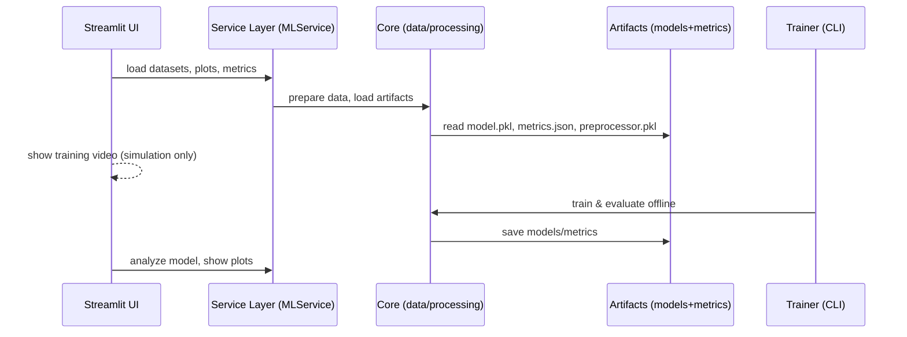

# ML Pipeline Explorer 

A Streamlit app to explore a complete ML pipeline: data preparation, model selection, analysis, and a playground for predictions. The UI simulates training with videos and loads pre-trained artifacts for performance and security.

## Features
- Step-by-step pipeline navigation (Data → Cleaning → Ready for ML → Model → Analysis → Playground)
- Training simulation popups with embedded videos
- Pre-trained models and metrics loaded from `artifacts/`
- Clean, responsive UI and accessible color palette
- SHAP insights, ROC/PR curves, confusion matrices

## Architecture (High level)


## Quickstart (Local)
1) Install dependencies
```bash
pip install -r requirements.txt
```
2) Verify artifacts exist
```bash
python check_models.py
```
3) Run the app
```bash
streamlit run app_refactored.py
```

## Training vs UI Separation
- Training is handled offline by the CLI script, not the UI.
- Train all datasets/models (optional):
```bash
python trainer_refactored.py
```
- The Streamlit app only loads artifacts from `artifacts/` and plays a simulation video during “training”.

## Deploy on Streamlit Cloud
1) Push this repo to GitHub with Git LFS enabled for `*.pkl`, `*.mp4`, `*.csv`.
2) In Streamlit Cloud, create a new app and set the main file to `app_refactored.py`.
3) Ensure `requirements.txt` is present (this repo includes it).

## Repository Layout
- `app_refactored.py`: Main Streamlit app (entry point)
- `trainer_refactored.py`: CLI training script (offline)
- `artifacts/`: Pre-trained models, metrics, plots (one folder per dataset/model)
- `static/animations/`: Training videos used by the UI
- `config/`: App, datasets, and model configs
- `core/`: Data loading, preprocessing, and utilities
- `services/`: `MLService` for orchestrating operations
- `views/`: Streamlit page views (data prep, model selection, analysis, playground)
- `visualization/`: Charts and plots utilities
- `datasets/`: Input CSVs (tracked via Git LFS)

## Security Notes
- No training from the UI (prevents abuse and heavy resource usage)
- All heavy operations are done offline via `trainer_refactored.py`
- Inputs validated before prediction; artifacts are read-only in production

## License
MIT (see LICENSE if included)
